# 💫 About Me:
🔭 I’m currently working on full-stack applications and real-world software projects, primarily using Flutter, Firebase and modern state-management patterns. I’m also expanding into Java and Spring Boot to strengthen my backend development skills.  👯 I’m looking to collaborate on open-source projects, full-stack applications and products that solve practical problems. I’m especially interested in opportunities where I can contribute across the stack and learn from experienced engineers.  🤝 I’m looking for help with system design, scalable backend architecture, database design and understanding the engineering practices used to build and maintain production-grade systems.  🌱 I’m currently learning Java, Spring Boot, DSA, System Design, REST APIs, databases and backend architecture, with a goal of becoming a stronger full-stack engineer.  💬 Ask me about Flutter, Dart, Java, Firebase, Riverpod, REST APIs, client-side routing, state management and the projects I’ve built while solving real-world development problems.  ⚡ Fun fact: I learn by building — I enjoy taking a real problem, figuring out why it exists, and turning the solution into a working product rather than just learning the theory.

# 💻 Tech Stack:
                                      
## 📊 GitHub Stats

<!-- Proudly created with GPRM ( https://gprm.itsvg.in ) -->
